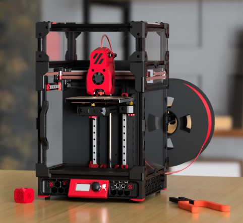

---

layout: default

title: Initial Startup

parent: The Build

nav_order: 5

---

<link  rel="stylesheet"  href="style.css">

# Please select your printer model to start
 

  <button type="button" class="btn btn-danger border" onclick="location.href = './v0initial.html';"> Voron V0</button>
  <button type="button" class="btn btn-danger border" onclick="location.href = './v2initial.html';"> Voron V2</button>

  <button type="button" class="btn btn-danger" onclick="location.href = './v1initial.html';"> Voron V1/Trident</button>
  <button type="button" class="btn btn-danger" onclick="location.href = './vswinitial.html';"> Voron Switchwire</button>

